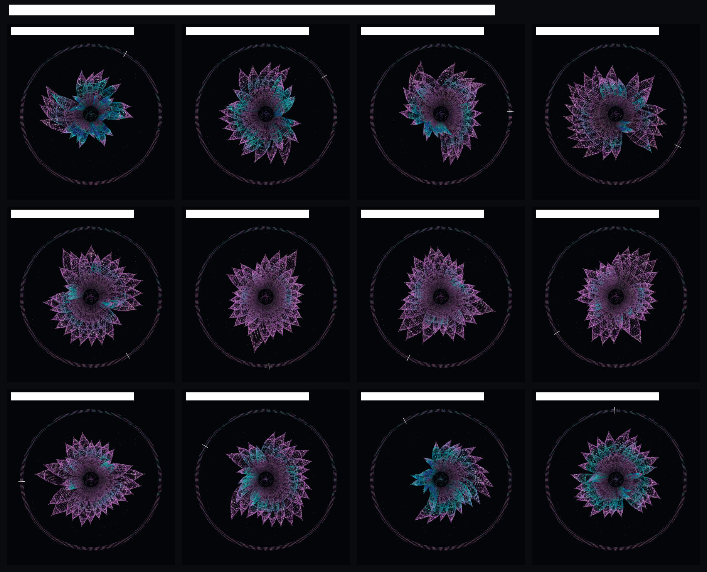

# hk-humidity

One year of the air over Hong Kong, hour by hour — 8,760 hours of it, drawn twice.

The air is wet in two different senses. **Relative humidity** says how full of
water the air is compared with how full it could be at its temperature. **Dew
point** says how much water is actually in it. Weather reports quote the first,
and the first forgets how warm the air is.

## The numbers

The file in `data/` is the raw JSON reply from
[Open-Meteo's historical weather archive](https://open-meteo.com/en/docs/historical-weather-api)
for one point over Hong Kong (22.302 °N, 114.174 °E), for every hour of 2025:
`relative_humidity_2m` (%), `dewpoint_2m` (°C) and `temperature_2m` (°C) —
8,760 rows, one per hour. It was fetched once and committed unchanged, and
every script here reads that file, so the whole thing runs with the wifi off.

## The picture


Both panels are the same 8,760 hours: 365 rows, one per day; 24 columns, one
per hour. Only the number that colours each square changes.

In relative humidity the stripes run **down**: 03:00 is the most humid hour of
every day (86 % on average) and 13:00 the driest (64 %) — a 22-point swing that
repeats 365 times and disappears completely in a daily average. In dew point
the stripes run **across**: the day vanishes and the year takes over, from
about 6 °C in January to 25 °C in July.

**What the picture hides.** Relative humidity hides how much water there is.
894 hours of this year read between 78 and 82 %, and their dew points run from
7.2 to 27.0 °C — the same "80 % humidity" is December air and July air, and
only the second panel tells them apart. It also hides the sky: this is a
model's reconstruction of one ~9 km grid cell, not a measurement at one
street, and it says nothing about which hour you actually got wet in.

## How to run it

```bash
uv run fetch.py
uv run print_humidity.py
uv run plot.py
```

`fetch.py` needs the internet, once. After that everything reads `data/`.

`out/humidity-year.png` is the first attempt — one line of daily means. It is
still here because it is the reason the grids exist: averaging the day away
threw out the strongest pattern in the file.

## The interface

```bash
uv run --with streamlit --with pandas streamlit run app.py
```

The grids show the whole year; `app.py` is the close-up. Choose a month and a
day and the page redraws that day's 24 hours — relative humidity on the left,
dew point on the right — with the month's average day drawn underneath, so you
can see whether a particular day follows its month's rhythm or breaks it.
Change the day and only the charts change; every day has exactly 24 readings,
and February offers 28 days, not 30.

## The bloom

```bash
uv run --with pygame-ce bloom.py
```

The grids and the flower are the same 8,760 numbers — the grid bent into a
wheel. One flower is one month; one petal is one day, and the radius of a
petal is the hour: the heart of the flower is 00:00, the petal tips are
24:00. The stripes that ran **down** the humidity grid now run outward
through every petal, and you can read the daily swing straight off a petal:
it swells and warms where its hours were humid, cools to blue where they
were dry. The curl of each petal is that day's mean dew point — the
"stripes run across" grid drawn as a gesture, summer days coiling and
winter days sitting almost straight.

The flower starts as a single petal — July the 1st — and every ←/→ (or the
mouse wheel) opens one more day; when the month is full, the next petal
belongs to the next month. The petals hold their places: day 1 sits at the
top, day 2 sits clockwise of it, and a petal, once grown, never moves again —
the month fills the wheel in order, like a clock being built. Move the mouse
over a petal and that day lights up while the others stay still, and the foot
of the window reads out that day: "day 05 under the cursor, humidity 81 %,
dew point 24.5 °C". ↑/↓ jump between months, SPACE lets the year grow by
itself. **Click the window once before pressing keys** — keys follow the
focused window, and the terminal you launched from would otherwise keep them.
Holding an arrow key keeps the flower growing; a left click also opens a petal
and a right click closes one; the window is mirrored by a line of text in the
terminal, so you can see the state even if the window is behind something.
The faint outer ring is still the whole year at a glance: one tick per day,
with a needle on the newest petal.

The whole year on one page:

```bash
uv run --with pygame-ce bloom.py --sheet out/bloom-year.png
```



**Why the winter flowers look ragged.** The petals are evenly spaced — day j
always sits at j/360 of the turn — but they are not evenly *sized*, and the
unevenness is the data. Petal reach is the day's mean humidity, and the
months differ wildly in how much that varies: a January swings from 33 %
(dry continental wind, the 12th) to 84 % (a humid spell, the 25th), a
51-point spread, so its flower is a mix of long plumes and stubs that lean
in opposite directions (the lean is dew point, and January had real cold
spells and a warm humid one). A July only spreads 15 points, 79 to 94 %, so
its flower is a regular, fully-open rosette. The tidy summer and the ragged
winter are the same design reading the same number — winter is simply a
more argumentative month.

`bloom_day.py` is the previous version, kept on purpose: there one flower was
one day (24 petals, one per hour) and the arrow keys scrubbed the year. It is
the same data read at the other end of the zoom — the day as a specimen, the
month as a habit.
