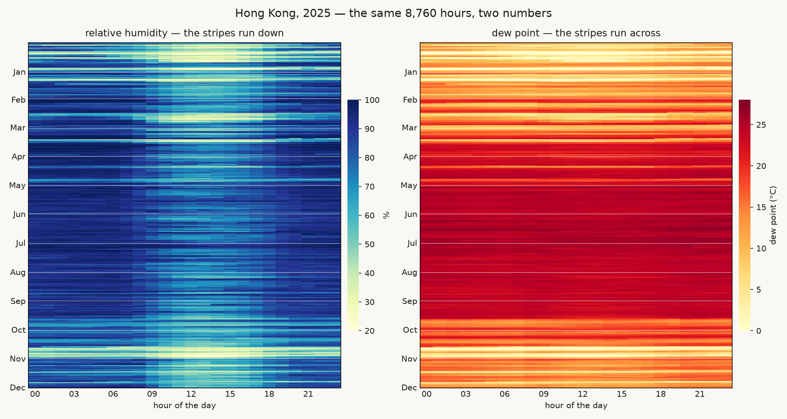

# hk-humidity

One year of the air over Hong Kong, hour by hour — 8,760 hours of it, drawn twice.

The air is wet in two different senses. **Relative humidity** says how full of
water the air is compared with how full it could be at its temperature. **Dew
point** says how much water is actually in it. Weather reports quote the first,
and the first forgets how warm the air is.

## The numbers

The file in `data/` is the raw JSON reply from
[Open-Meteo's historical weather archive](https://open-meteo.com/en/docs/historical-weather-api)
for one point over Hong Kong (22.302 °N, 114.174 °E), for every hour of 2025:
`relative_humidity_2m` (%), `dewpoint_2m` (°C) and `temperature_2m` (°C) —
8,760 rows, one per hour. It was fetched once and committed unchanged, and
every script here reads that file, so the whole thing runs with the wifi off.

## The picture



Both panels are the same 8,760 hours: 365 rows, one per day; 24 columns, one
per hour. Only the number that colours each square changes.

In relative humidity the stripes run **down**: 03:00 is the most humid hour of
every day (86 % on average) and 13:00 the driest (64 %) — a 22-point swing that
repeats 365 times and disappears completely in a daily average. In dew point
the stripes run **across**: the day vanishes and the year takes over, from
about 6 °C in January to 25 °C in July.

**What the picture hides.** Relative humidity hides how much water there is.
894 hours of this year read between 78 and 82 %, and their dew points run from
7.2 to 27.0 °C — the same "80 % humidity" is December air and July air, and
only the second panel tells them apart. It also hides the sky: this is a
model's reconstruction of one ~9 km grid cell, not a measurement at one
street, and it says nothing about which hour you actually got wet in.

## How to run it

```bash
uv run fetch.py
uv run print_humidity.py
uv run plot.py
```

`fetch.py` needs the internet, once. After that everything reads `data/`.

`out/humidity-year.png` is the first attempt — one line of daily means. It is
still here because it is the reason the grids exist: averaging the day away
threw out the strongest pattern in the file.

## The interface

```bash
uv run --with streamlit --with pandas streamlit run app.py
```

The grids show the whole year; `app.py` is the close-up. Choose a month and a
day and the page redraws that day's 24 hours — relative humidity on the left,
dew point on the right — with the month's average day drawn underneath, so you
can see whether a particular day follows its month's rhythm or breaks it.
Change the day and only the charts change; every day has exactly 24 readings,
and February offers 28 days, not 30.
